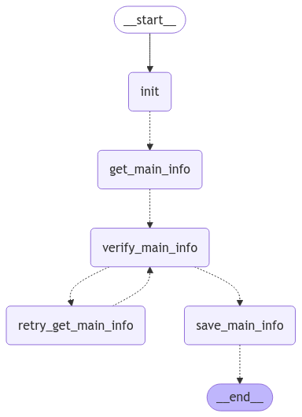
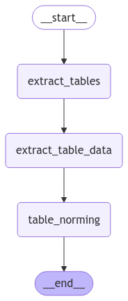

# DocNetAgent: Document Processing and Information Extraction

## Overview

DocNetAgent is a Python-based project designed to automate the extraction of key information from documents, particularly invoices. It leverages Optical Character Recognition (OCR) and Large Language Models (LLMs) to process document images and identify relevant data points. The system is structured as a workflow, making it modular and extensible for various document processing tasks.

## Features

*   **Document Processing via OCR:**  Utilizes Azure Document Intelligence to perform OCR on document images, extracting text content from both local files and publicly accessible URLs.
*   **Intelligent Information Extraction:** Employs Large Language Models (LLMs) to analyze the OCR output and extract structured information, specifically targeting key invoice details such as supplier name, invoice number, and invoice date.
*   **Data Verification and Retry Mechanism:** Implements a verification step using LLMs to assess the confidence level of the extracted information. In cases of low confidence, the system can retry the extraction process with refined prompts.
*   **Workflow Orchestration with LangGraph:**  The entire document processing pipeline is defined as a state graph using LangGraph, providing a clear and manageable structure for complex workflows. More information and tutorials about LangGraph can be found here: https://langchain-ai.github.io/langgraph/tutorials/introduction/
*   **Input Flexibility:** Supports processing documents from local file paths within an `input_data` directory and directly from URLs.
*   **Structured Output:** Extracted information is saved in JSON format in the `output_data` directory, making it easy to integrate with other systems or for further analysis.

## Workflow Visualizations

This project utilizes LangGraph to define the document processing workflow. Visual representations of the workflows are automatically generated as PNG images.

### OCR Workflow

This image shows the state graph for the Optical Character Recognition (OCR) process. It outlines the steps involved in taking a document path as input, performing OCR using Azure Document Intelligence, and saving the extracted text.

### Main Data Extraction Workflow

This image illustrates the state graph for the main data extraction process. The workflow takes the OCR output, uses an LLM to extract key information (like supplier, invoice number, and date), verifies the extracted information, and includes a retry mechanism for cases where confidence is low.

### End-to-End Workflow

Here you see a high-level overview of the complete end-to-end document processing workflow. It shows how the OCR workflow and the main data extraction workflow are connected to form the entire pipeline, starting from document input to final information extraction.

## Architecture

The project is organized into several key modules, each responsible for a specific aspect of the document processing workflow:

*   **`src/`**: This is the root directory containing all source code.
    *   **`agents/`**:  This directory houses the agents responsible for specific tasks within the workflow.
        *   **`extract_main_data_agent.py`**: Contains the logic for the agent that extracts the main information (supplier, invoice number, invoice date) from the OCR text. It defines the workflow for information extraction, verification, and retry logic using LangGraph. Prompts for guiding the LLM are located in the `prompts/` subdirectory.
        *   **`ocr_agent.py`**: Implements the agent responsible for performing OCR on documents using Azure Document Intelligence. It handles both local file paths and URLs as input.
        *   **`prompts/`**:  Contains prompt templates used by the agents to interact with the Large Language Model.
            *   **`extract_main_data_prompts.py`**: Defines prompts used by the `extract_main_data_agent` for initial information extraction, verification, and retry attempts.
    *   **`handler/`**: This directory contains modules that handle interactions with external services and data storage.
        *   **`azure_blob_storage_handler.py`**: (Currently not directly used in the main workflow) Provides functionality to interact with Azure Blob Storage, potentially for storing or retrieving documents.
        *   **`azure_ocr_handler.py`**: (Currently not directly used as `ocr_processor_client.py` is used instead)  Potentially an alternative implementation for interacting with Azure OCR services.
        *   **`cosmos_db_handler.py`**: (Currently not directly used in the main workflow)  Provides functionality for interacting with Azure Cosmos DB, potentially for storing processed data.
        *   **`ocr_processor_client.py`**:  Encapsulates the client and logic for interacting with Azure Document Intelligence for OCR processing. It handles authentication and text extraction from both URLs and base64 encoded images.
    *   **`model.py`**: Defines the data models used throughout the project using Pydantic. These models represent the state of the workflow at different stages, including:
        *   `BaseState`:  A base state containing common attributes like document path, error messages, and token usage.
        *   `PerformOCRState`: Extends `BaseState` and includes the OCR extracted text.
        *   `ExtractMainDataState`: Extends `BaseState` and includes the OCR text, extracted main information (`MainInfo`), confidence level, and retry status.
        *   `MainInfo`:  A model to structure the extracted main invoice information (supplier, invoice number, invoice date).
    *   **`utils.py`**: Contains utility functions and configurations used across the project. Currently, it initializes the Azure OpenAI Large Language Model client.
    *   **`util_functions.py`**:  Provides general utility functions, such as:
        *   Image format and MIME type handling.
        *   Conversion of images to base64 data URLs.
        *   Adding image content (from local files or URLs) to message lists for LLM prompts.
    *   **`main.py`**:  Serves as the entry point for the application. It defines the overall workflow by constructing and connecting the individual agent graphs (`ocr_graph` and `extract_main_data_graph`) using LangGraph. It also includes example functions (`main_local_files` and `main_url`) to run the workflow on local files and URLs, respectively.

## Getting Started

To run this project, you will need to set up the necessary environment and dependencies.

### Prerequisites

1.  **Python:** Ensure you have Python 3.12 or a compatible version installed.
2.  **Azure Account and Services:** You will need an Azure account with access to:
    *   **Azure OpenAI Service:**  To utilize Large Language Models for information extraction and verification.
    *   **Azure Document Intelligence:**  To perform OCR on documents.
3.  **API Keys and Endpoints:** Obtain the necessary API keys and endpoints for Azure OpenAI and Azure Document Intelligence services from your Azure portal.
4.  **Environment Variables:** Set the following environment variables, ideally in a `.env` file in the project's root directory:
    *   `AZURE_OPENAI_DEPLOYMENT`: The deployment name for your Azure OpenAI model.
    *   `ENDPOINT_DOCINT`: The endpoint URL for your Azure Document Intelligence service.
    *   `API_KEY_DOCINT`: The API key for your Azure Document Intelligence service.

### Installation

1.  **Install uv:** https://docs.astral.sh/uv/getting-started/installation/
2.  **Clone the repository:** Clone this project repository to your local machine.
3.  **Navigate to the project directory:** `cd <project_directory>`
4.  **Create a virtual environment using uv:** `uv venv .venv`
5.  **Install dependencies using uv:** `uv sync`
6.  **Select Python Interpreter:** In your IDE, select the Python interpreter located within the virtual environment: `.venv/bin/python3`. This ensures you are using the correct Python environment with all project dependencies.

### Developing

When contributing to this project or adding new functionalities, follow these steps to manage dependencies:

1.  **Install a new library:** If you need to add a new Python library, use `uv pip install <library_name>`. This command installs the library within your virtual environment.
2.  **Update `requirements.txt`:** After installing new libraries, update the `requirements.txt` file to reflect these changes. Run `uv pip freeze > requirements.txt` to regenerate the file with the current environment's dependencies.
3.  **Add requirements to uv management:** To ensure `uv` is aware of the new requirements, use `uv add -r requirements.txt`. This command tells `uv` to manage the dependencies listed in `requirements.txt`.
4.  **Add and commit changes:** After making changes and updating dependencies, you can add your changes to Git and commit them. 

### Running the Project

The `main.py` file provides two main functions to run the document processing workflow:

*   **`main_local_files()`**: Processes document images located in the `input_data` directory.
    1.  Create an `input_data` directory in the project's root if it doesn't exist.
    2.  Place the document image files (e.g., PNG, JPEG) you want to process into the `input_data` directory.
    3.  Run the script: `python main.py`

*   **`main_url()`**: Processes a predefined list of document URLs.
    1.  Modify the `urls` list in the `main_url()` function in `main.py` to include the URLs of the documents you want to process.
    2.  Run the script: `python main.py`

### Output

Processed output, including OCR text and extracted main information, is saved as JSON files in the `output_data` directory. For each input document, a corresponding JSON file will be created in `output_data` with the extracted data.

## Usage

1.  **Prepare Input Documents:** Place document images in the `input_data` directory or configure URLs in `main_url()` as described in "Running the Project".
2.  **Run the Script:** Execute `python main.py`.
3.  **Review Output:** Check the `output_data` directory for JSON files containing the extracted information. Each JSON file will be named based on the input document filename or URL (sanitized for file system compatibility). The JSON file will contain:
    *   `ocr_text`: The full text extracted by OCR.
    *   `supplier`: The extracted supplier name (or "null" if not found).
    *   `invoice_number`: The extracted invoice number (or "null" if not found).
    *   `invoice_date`: The extracted invoice date (or "null" if not found).
    *   `confidence`: The confidence level of the extraction ("VERIFIED", "CERTAIN", "UNSURE", or "FALSE").
    *   `reason`:  A reason for "UNSURE" or "FALSE" confidence levels.
    *   `error`: Any error messages encountered during processing.

